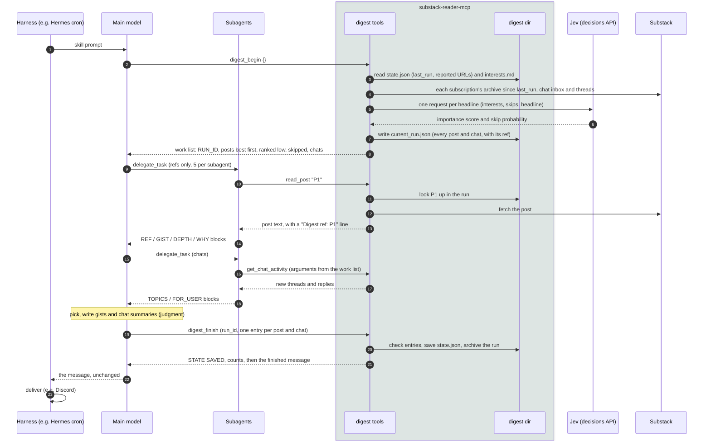

# Digest tools: a worked example

This page follows one small digest run from start to finish: what each tool takes, what it returns, and where every piece of the final message comes from. [digest.md](digest.md) explains why the tools exist and how to customize them.

The publications, posts and URLs are made up. Every block marked *output* is real, though: `test/docs-example.test.ts` runs this exact scenario through the server (with a fake Substack and a fake Jev), using the arguments shown here, and fails if any output on this page no longer matches.

## The whole run



Unlike Medium's digest, the model doesn't shortlist: every post under POSTS gets read. Its judgment comes at the one note: which posts are picks, how to sum up each post, and what the chats were about. Fetching, ranking, deduplication, layout and state are the server's job.

**Where each part of the final message comes from**

| Part of the message | Written by |
|---|---|
| Titles, publications, URLs, `[paid]`, "preview only" | The server, from the run file (`preview_only` comes from the model's entry) |
| Gists, *Why* lines, chat summaries | The main model, in `digest_finish`'s arguments. It rewrites them from the subagents' blocks; the subagents never call `digest_finish` |
| Header counts, "Also new", "Couldn't read", the 🗑 line | The server |
| Layout and order | The server (`src/digest/render.ts`) |

## 1. `digest_begin`

Fetches everything new since the last run, ranks it, and writes `current_run.json`. It saves no state. Call it with no arguments.

<!-- args: digest_begin -->
| Field | Default | Meaning |
|---|---|---|
| `max_posts` | 100 | Most posts in one run, newest first; the rest carry over to the next run |
| `include_chats` | true | Also check chats and DMs for new activity |
| `first_run_lookback` | `"48h"` | How far back to look when there's no `state.json` yet |

The example's `state.json` has `last_run` a day earlier and one post already reported. Jev is on (`SUBSTACK_CLASSIFIER=jev`), with `SUBSTACK_DIGEST_RANK_FLOOR=0.3`. Arguments:

<!-- example: digest_begin -->
```json
{}
```

While fetching, the server asks Jev about each headline. This is the request for the first post:

<!-- generated: jev_request -->
```json
{
  "model": "typesafe/jev-1.13",
  "state": {
    "reader": {
      "interests": [
        "Databases and distributed systems, with real numbers",
        "Cooking and fermentation from people who do it"
      ],
      "skips": [
        "Podcast episode notes"
      ]
    },
    "headline": {
      "title": "Replication lag, explained with graphs",
      "subtitle": "Why the replica fell 40 seconds behind",
      "author": "Dana Kim",
      "publication": "Systems Notes"
    }
  },
  "questions": {
    "importance": {
      "type": "score",
      "instructions": "Given the reader's interests and skips, how much would this reader want to read this post?",
      "criteria": [
        "Not for this reader: off-topic or matches a skip pattern",
        "Marginal: related area, little reason to open it",
        "Worth a skim",
        "Must read: squarely in the reader's interests with real substance"
      ]
    },
    "skip_ctx": {
      "type": "noul",
      "instructions": "Should this post be dropped because it matches one of the reader's skips?"
    }
  }
}
```

The fake Jev here answers P1 with `{"importance": {"type": "score", "score": 2.7}, "skip_ctx": {"type": "noul", "noul": 0.02}}`. The score is on the four-level scale (0–3), so P1's rank is 2.7 / 3 = 90. A skip probability of 70% or more sets the post aside (`SUBSTACK_DIGEST_SKIP_THRESHOLD`). Output:

<!-- generated: digest_begin -->
```text
RUN_ID: 20261004-110024-d0c5
SINCE: 2026-10-03T11:00:31Z (Sat, Oct 3, 7:00 AM EDT)
COUNTS: 4 new posts, 1 chats with activity, 2 publications checked, 0 not checked, 0 carried over from earlier runs
CLASSIFIER: jev (typesafe/jev-1.13): 4 ranked · 1 skipped (threshold 70%) · 1 below rank floor 30%

POSTS, best-ranked first (ref | rank 0–100, the classifier's guess at how much the user wants it | title | publication | date | access | type | url):
P1 | 90 | Replication lag, explained with graphs | Systems Notes | Oct 3, 10:00 AM | free | newsletter | https://systemsnotes.substack.com/p/replication-lag
P2 | 62 | Fermenting hot sauce at home | Field Kitchen | Oct 3, 9:00 AM | paid | newsletter | https://fieldkitchen.substack.com/p/hot-sauce

RANKED LOW (below 30; reading them is optional, and any without an entry are listed as "Also new"):
P3 | 20 | Weekly links #41 | Systems Notes | Oct 3, 8:30 AM | free | newsletter | https://systemsnotes.substack.com/p/weekly-links-41

SKIPPED BY CLASSIFIER (match the user's Skip list; don't read them, no entry needed):
P4 Episode 88: sourdough in a heatwave

CHATS WITH ACTIVITY (ref | chat id | name | activity | get_chat_activity arguments):
C1 | 101 | Systems Notes | 1 new thread, 0 threads with new replies | {"since":"2026-10-03T11:00:31Z","chat_id":"101","transcripts":true}

INTERESTS (from interests.md):
## Interests
- Databases and distributed systems, with real numbers
- Cooking and fermentation from people who do it

## Skip
- Podcast episode notes

WARNINGS: none

NEXT: Read every post (the 2 under POSTS, best-ranked first): read_post takes the ref itself (url: "P3"), so hand subagents the refs exactly as listed here, never renumbered. Summarize every chat (C1). Then call digest_finish once with run_id "20261004-110024-d0c5", one posts entry per post you read (none for skipped posts; ranked-low posts only if you read them) ({"ref": "P1", "section": "pick" | "other" | "unreadable", "gist", "why", "preview_only"}) and one chats entry per chat ({"id": "the chat id", "topics", "for_user"}).
```

Things to notice:

- **Refs are given out before ranking**, newest first, and the POSTS list is then sorted by rank. A ref means the same post for the whole run, whatever order the model sees.
- **The already-reported post** ("Knife skills") has no ref at all.
- **Three lists, three rules:**
  - **POSTS:** read every one.
  - **RANKED LOW:** reading is optional. Any post without an entry goes under "Also new".
  - **SKIPPED BY CLASSIFIER:** never read, and no entry needed.
- **The chat line carries its own `get_chat_activity` arguments**, so a subagent can copy them as they are.
- **The `NEXT:` line** repeats the run_id and the entry shapes `digest_finish` expects.

## 2. Reading posts by ref

The main model hands subagents refs only. A subagent passes the ref to `read_post`, and the server looks it up in the run (`current_run.json`, else `previous_run.json`), so a summary can't end up attached to the wrong post even if the model renumbers its chunks.

<!-- args: read_post -->
| Field | Default | Meaning |
|---|---|---|
| `url` | | A post URL (any Substack link format), a numeric post id, or a ref (`P1`) |
| `format` | `markdown` | `markdown`, `text` or `html` |
| `start` | 0 | Character offset, for reading a long post in pages |
| `max_chars` | 40,000 | Most body characters per call; the reply says where to continue |

<!-- example: read_post -->
```json
{ "url": "P1", "format": "text" }
```

Output (the example post's body is three paragraphs long). The `- Digest ref:` line confirms which post the subagent got:

<!-- generated: read_post -->
```text
# Replication lag, explained with graphs
_Why the replica fell 40 seconds behind_

- Author: Dana Kim
- Published: 2026-10-03T14:00:00Z
- URL: https://systemsnotes.substack.com/p/replication-lag
- Audience: everyone
- Words: 2100
- Digest ref: P1

Our read replica fell 40 seconds behind every night at 02:00.

What the graphs showed

…
```

## 3. What subagents return

This part is model output, so the test doesn't check it. The skill asks for one block per post:

```text
REF: P1
ACCESS: full
TYPE: analysis
GIST: A read replica fell 40 seconds behind every night because a 02:00 batch job wrote one huge transaction. Splitting it into 10k-row batches kept lag under a second, and the graphs show where the time went.
DEPTH: 4
WHY: The lag graphs and the batch-size experiment carry the argument; the gist can't.
```

and one per chat:

```text
CHAT_ID: 101
TOPICS: A reader asked whether anyone runs logical replication across regions; six replies compare it with physical replication.
FOR_USER: none
POSTS_DISCUSSED: none
```

These blocks come back to the main model as the result of its `delegate_task` calls. Nothing goes to the server yet.

## 4. `digest_finish`

The main model gives one entry per post it read and one per chat. The server checks them against the run, fills in titles, publications and links itself, saves state and returns the finished message. A second call with the same `run_id` saves nothing and returns the same message.

<!-- args: digest_finish -->
| Field | Type | Meaning |
|---|---|---|
| `run_id` | string | `RUN_ID` from `digest_begin` (required) |
| `posts` | entry[] | One per post read. Picks in the order they should appear; the rest in any order |
| `chats` | entry[] | One per chat: `id` (from the work list), `topics` (1–3 sentences), `for_user` (a question or mention for the user, else `"none"`) |
| `render` | boolean | `false` returns plain-text sections instead of the Discord message |
| `dry_run` | boolean | Render and check, but save nothing |

A post entry:

| Field | Meaning |
|---|---|
| `ref` | The post's ref (`P1`), or `url` if there's no ref |
| `section` | `pick` (read in full), `other`, or `unreadable` (`read_post` failed) |
| `gist` | 1–2 sentences: the argument or findings |
| `why` | Picks only: why it's worth reading in full |
| `preview_only` | `true` when `read_post` returned only a preview |
| `error` | Unreadable posts only: the error |

A post under POSTS with no entry isn't an error. It's listed under "Couldn't read" as not summarized, with a warning. The `WARNINGS:` lines show anything the server fixed up or noticed.

The example's arguments. P2 is paid and the subagent got only a preview. P3 was ranked low and not read, so it has no entry:

<!-- example: digest_finish -->
```json
{
  "run_id": "20261004-110024-d0c5",
  "posts": [
    { "ref": "P1", "section": "pick", "gist": "A nightly batch job wrote one huge transaction and the replica fell 40 seconds behind; 10k-row batches kept lag under a second.", "why": "The lag graphs and the batch-size experiment carry the argument." },
    { "ref": "P2", "section": "other", "gist": "Salt ratios for lacto-fermented hot sauce, and how to tell good bubbles from bad.", "preview_only": true }
  ],
  "chats": [
    { "id": "101", "topics": "A reader asked whether anyone runs logical replication across regions; six replies compare it with physical replication.", "for_user": "none" }
  ]
}
```

Output. The harness's reply should be everything after the `=====` line:

<!-- generated: digest_finish -->
```text
STATE SAVED: yes (last_run 2026-10-04T11:00:24Z; 5 reported posts; 0 publications pending)
COUNTS: 4 posts (1 picks, 1 other, 0 couldn't read, 0 not summarized, 1 skipped, 1 ranked low and unread), 1 chats, 0 publications not checked, 0 given up
WARNINGS: none
===== DIGEST: reply with exactly the text below, nothing before or after =====
📬 **Substack** — 4 new posts, 1 chat with new activity (since Sat, Oct 3, 7:00 AM EDT)

⭐ **Read in full**
1. **Replication lag, explained with graphs** — Systems Notes
   A nightly batch job wrote one huge transaction and the replica fell 40 seconds behind; 10k-row batches kept lag under a second.
   _Why:_ The lag graphs and the batch-size experiment carry the argument.
   https://systemsnotes.substack.com/p/replication-lag

📰 **Everything else**
**Field Kitchen**
• Fermenting hot sauce at home [paid] (preview only) — Salt ratios for lacto-fermented hot sauce, and how to tell good bubbles from bad. https://fieldkitchen.substack.com/p/hot-sauce

📎 **Also new** _(ranked low, not read)_
• Weekly links #41 — Systems Notes https://systemsnotes.substack.com/p/weekly-links-41

💬 **Chats**
• Systems Notes: A reader asked whether anyone runs logical replication across regions; six replies compare it with physical replication.

🗑 Skipped 1 by the classifier
```

What was saved, and why:

- **Every post in the run counts as reported:** the two read, the ranked-low P3 and the skipped P4. None of them come back tomorrow.
- **`last_run`** is when `digest_begin` started (the server's clock), not when `digest_finish` ran, so posts published during the run turn up next time.
- **`current_run.json` becomes `previous_run.json`**, and a copy goes to `runs/`.

## 5. Checking and repairing state

`digest_status` takes no arguments and is read-only. After the run above:

<!-- generated: digest_status -->
```text
DIGEST DIR: /data/substack_digest
TIME ZONE: America/New_York
STATE FILE: ok
LAST RUN: 2026-10-04T11:00:24Z (Sun, Oct 4, 7:00 AM EDT)
REPORTED POSTS: 5 (newest 500 kept)
PENDING PUBLICATIONS: 0
CURRENT RUN: none
PREVIOUS RUN: 20261004-110024-d0c5, started 2026-10-04T11:00:24Z, committed 2026-10-04T11:00:24Z, 4 posts, 1 chats
RECENT RUNS (run id | started | committed | posts | chats):
- 20261004-110024-d0c5 | 2026-10-04T11:00:24Z | 2026-10-04T11:00:24Z | 4 | 1
CLASSIFIER CONFIG: jev (typesafe/jev-1.13) · skip threshold 70% · rank floor 30%
```

`mark_reported` adds posts to the reported list without a run, for example to keep a post from coming back.

<!-- args: mark_reported -->
| Field | Meaning |
|---|---|
| `urls` | Post URLs |
| `last_run` | Optional: set `last_run` to this ISO time |

<!-- example: mark_reported -->
```json
{ "urls": ["https://fieldkitchen.substack.com/p/sourdough-starter"] }
```

<!-- generated: mark_reported -->
```text
MARKED: 1 added, 0 already reported. reported_posts now has 6.
LAST_RUN: unchanged (2026-10-04T11:00:24Z)
```

## Keeping this page accurate

`npm test` runs `test/docs-example.test.ts`, which checks two things:

- **Every argument table lists exactly the tool's input fields.** Adding or renaming a field without updating the table fails the test. (The post-entry table isn't checked.)
- **Every output block matches what the tools return now,** using the arguments in the `example` blocks.

After changing a tool's output on purpose, regenerate the output blocks and review the diff:

```sh
UPDATE_DOCS=1 npx vitest run test/docs-example.test.ts
```

The test doesn't rewrite the prose, the tables' descriptions or the subagent blocks in step 3, so reread those when the behavior changes.
